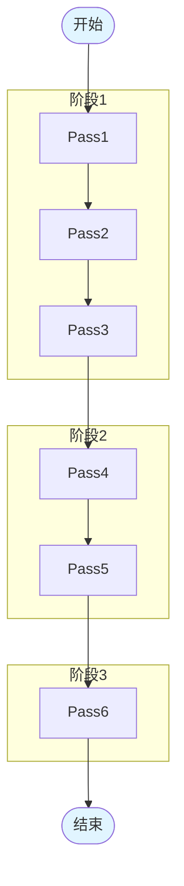
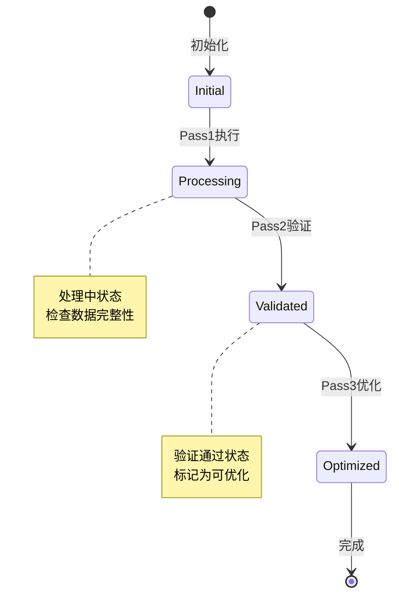

# [业务名称] 业务流分析报告

## 1. 业务概述

- **业务名称**：[业务名称]
- **业务目标**：[业务目标]
- **触发条件**：[触发条件]
- **适用范围**：[适用范围]

## 2. 涉及的 Pass 模块

| 序号 | Pass 名称 | 阶段 | 主要功能 |
|------|-----------|------|----------|
| 1 | [Pass1] | [阶段] | [功能描述] |
| 2 | [Pass2] | [阶段] | [功能描述] |
| ... | ... | ... | ... |

## 3. 执行流程

### 3.1 整体流程图

## 4. 依赖关系

- [Pass2] 依赖 [Pass1] 的输出
- [Pass5] 依赖 [Pass4] 的状态
- [数据流1]：[Pass1] → [数据A] → [Pass2]
- [数据流2]：[Pass3] → [数据B] → [Pass5]
- [状态1]：[Pass1] 设置的状态被 [Pass4] 使用
- [状态2]：[Pass2] 设置的标志被 [Pass6] 检查

## 5. 数据流转

### 5.1 关键数据变化

| 数据项 | 来源 Pass | 变化描述 | 目标 Pass |
|--------|-----------|----------|-----------|
| [数据A] | [Pass1] | [变化说明] | [Pass2] |
| [数据B] | [Pass3] | [变化说明] | [Pass5] |
| [数据C] | [Pass4] | [变化说明] | [Pass6] |

## 6. 状态变化

### 6.1 状态机图

### 6.2 关键状态变更

| 状态名称 | 初始值 | 设置 Pass | 变化条件 | 使用 Pass |
|----------|--------|-----------|----------|-----------|
| [状态1] | [初始值] | [Pass1] | [变化条件] | [Pass4] |
| [状态2] | [初始值] | [Pass2] | [变化条件] | [Pass6] |

## 7. 各 Pass 详细说明

### [Pass1 名称]

- **功能**：[功能描述]
- **输入**：[输入描述]
- **输出**：[输出描述]
- **关键逻辑**：[关键逻辑说明]
- **与其他 Pass 的关系**：[依赖关系说明]

### [Pass2 名称]

- **功能**：[功能描述]
- **输入**：[输入描述]
- **输出**：[输出描述]
- **关键逻辑**：[关键逻辑说明]
- **与其他 Pass 的关系**：[依赖关系说明]

[... 其他 Pass 的详细说明]

## 8. 业务价值

- **性能提升**：[性能提升说明]
- **资源优化**：[资源优化说明]
- **功能增强**：[功能增强说明]

## 9. 典型应用场景

- [场景1描述]
- [场景2描述]
- [场景3描述]

## 10. 注意事项

- [注意事项1]
- [注意事项2]

## 11. 相关文件

- **文档**：[文档路径]
- **代码**：[代码路径列表]
