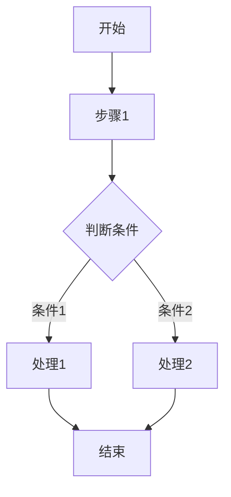

# Pass 分析文档模板

## 1. Pass 概述

- **Pass名称**：[Pass名称]
- **Pass类型**：[Tensor Graph Pass / Tile Graph Pass / Block Graph Pass / Execute Graph Pass]
- **简要描述**：[简要描述Pass业务功能]

## 2. 代码分析

### 2.1 主要功能

[描述Pass的核心功能，包括：
- Pass要解决什么问题
- Pass的主要处理目标
- Pass的输入输出特点]

### 2.2 处理流程

#### 2.2.1 PreCheck 阶段

[描述PreCheck阶段的处理逻辑：
- PreChecker的作用
- 检查的具体内容
- 检查失败的处理方式]

#### 2.2.2 RunOnFunction 阶段

[描述RunOnFunction阶段的处理逻辑：
- 入口函数的主要流程
- 遍历操作的方式
- 核心处理步骤]

#### 2.2.3 PostCheck 阶段

[描述PostCheck阶段的处理逻辑：
- PostChecker的作用
- 验证的具体内容
-验证失败的处理方式]

#### 2.2.4 关键函数的核心逻辑

[列出关键函数并描述其核心逻辑：

**函数1：[函数名称]**
- **功能**：[函数功能描述]
- **输入**：[输入参数说明]
- **输出**：[输出参数说明]
- **算法复杂度**：[时间复杂度和空间复杂度]
- **核心逻辑**：[详细描述函数的处理流程]

**函数2：[函数名称]**
- **功能**：[函数功能描述]
- **输入**：[输入参数说明]
- **输出**：[输出参数说明]
- **算法复杂度**：[时间复杂度和空间复杂度]
- **核心逻辑**：[详细描述函数的处理流程]]

#### 2.2.5 核心流程图

[使用Mermaid或其他方式绘制Pass的核心业务流程图

或者使用文字描述核心流程：
1. 步骤1：[描述]
2. 步骤2：[描述]
3. 步骤3：[描述]
...]

## 3. 业务分析

### 3.1 适用场景

[描述Pass适用的业务场景：
- 什么样的图结构会触发此Pass
- 什么样的模式会被此Pass优化
- 什么样的情况下需要运行此Pass]

### 3.2 优化效果

[描述Pass的优化效果：
- 性能提升
- 内存节省
- 代码简化
- 其他收益]

### 3.3 典型应用场景

[通过具体示例说明Pass的应用场景（**特别注意**，必须包含示例）：

**场景1：[场景名称]**
- **场景描述**：[详细描述场景]
- **输入图结构**：[通过具体示例图描述输入的Operation和Tensor结构]
- **输出图结构**：[通过具体示例图描述输出的Operation和Tensor结构]
- **优化效果**：[说明优化前后的差异]

**场景2：[场景名称]**
- **场景描述**：[详细描述场景]
- **输入图结构**：[通过具体示例图描述输入的Operation和Tensor结构]
- **输出图结构**：[通过具体示例图描述输出的Operation和Tensor结构]
- **优化效果**：[说明优化前后的差异]]

## 4. OPCode 特判分析

[列出代码中对特定OPCode的特判处理：

**视图类 OPCode**：

- **OP_VIEW**
  - **特判条件**：[判断条件]
  - **特判位置**：[给出函数名，不需行号]
  - **处理逻辑**：[具体处理方式]

- **OP_ASSEMBLE**
  - **特判条件**：[判断条件]
  - **特判位置**：[给出函数名，不需行号]
  - **处理逻辑**：[具体处理方式]

- **OP_RESHAPE**
  - **特判条件**：[判断条件]
  - **特判位置**：[给出函数名，不需行号]
  - **处理逻辑**：[具体处理方式]

**其他 OPCode 特判**（不再包含视图类OPCode）：

- **[OPCODE名称]**
  - **特判条件**：[判断条件]
  - **特判位置**：[给出函数名，不需行号]
  - **处理逻辑**：[具体处理方式]]

## 5. 总结

[总结Pass的关键信息：
- Pass的核心价值
- Pass的主要特点
- Pass的使用建议
- Pass的适用范围]

## 6. 相关文件

[列出与Pass相关的源代码文件：

- **主要实现文件**：
  - `[文件路径]`：[文件描述]

- **辅助文件**：
  - `[文件路径]`：[文件描述]]

## 7. 附录

### 7.1 术语表

[解释文档中使用的关键术语]

### 7.2 参考资料

[列出相关的参考资料]

### 7.3 修改历史

[记录文档的修改历史，格式：“年/月/日：修改内容”]
